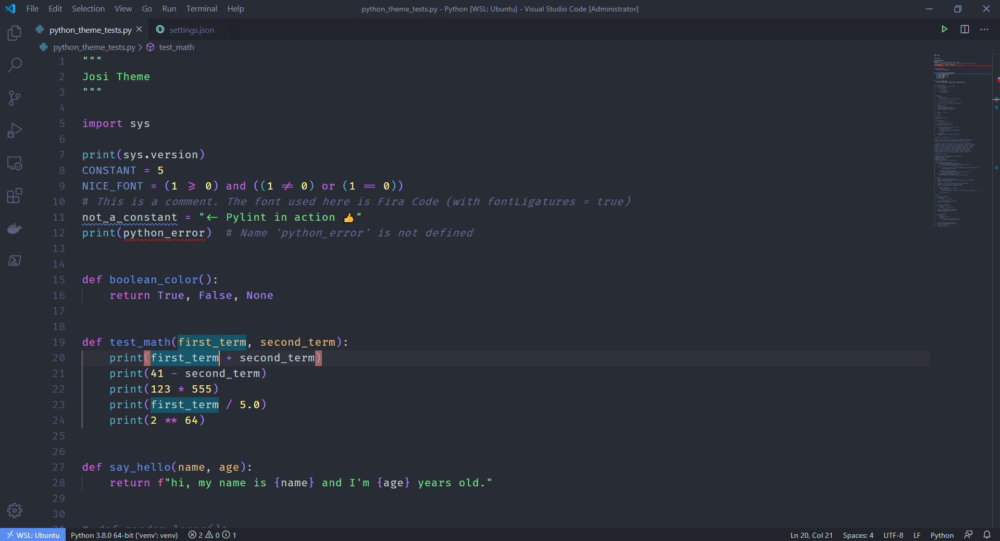
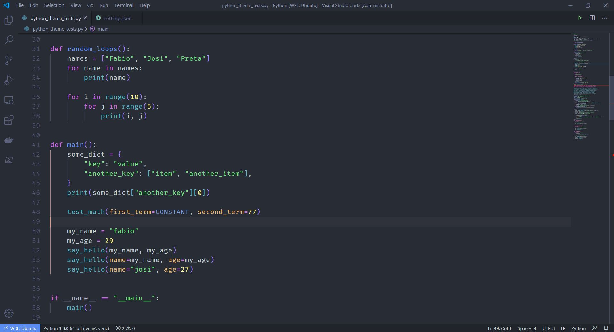
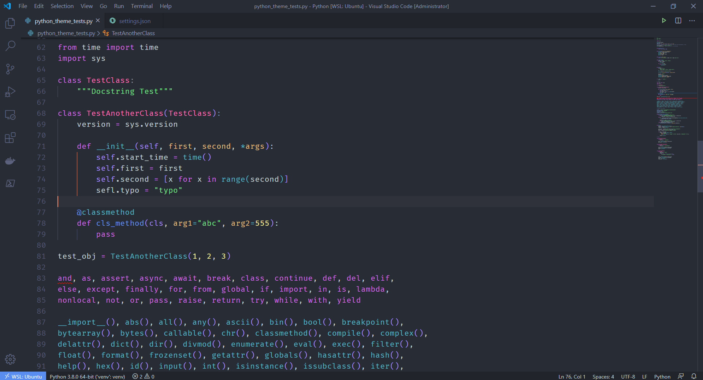
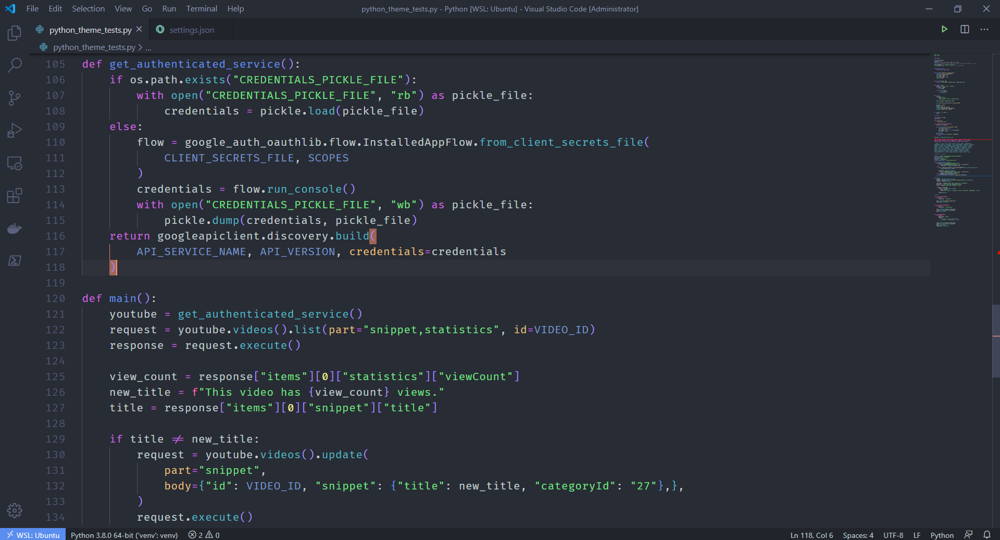
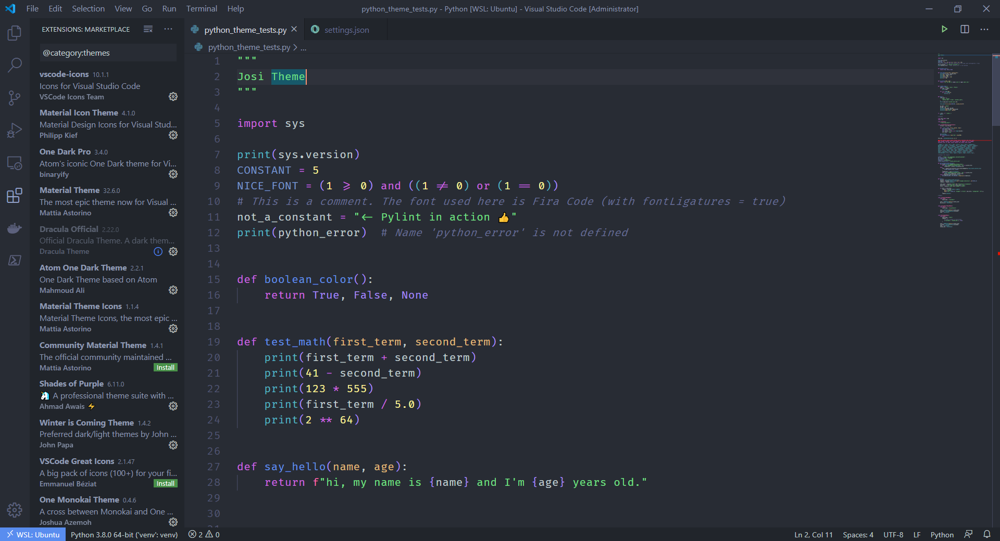

# Josi Theme

This theme is just a few tweaks my wife (Josi) and I made to [Eva-Theme](https://github.com/fisheva/Eva-Theme). Please go check the original, it's an amazing theme. Really beautiful.

We  just changed a few colors for a better Python experience, so the theme is tested only in Python.

It's a dark theme with colorful syntax. Nothing shiny, but colorful.

Enjoy!

# Images






# Bracket Pair Colorizer
```json
{
    "bracketPairColorizer.showHorizontalScopeLine": false,
    "bracketPairColorizer.showVerticalScopeLine": false,
    "bracketPairColorizer.consecutivePairColors": [
        "()",
        "[]",
        "{}",
        [
            "#A78CFA",
            "#56B7C3",
            "#6494ED",
        ],
        "#e51400"
    ]
}
```
